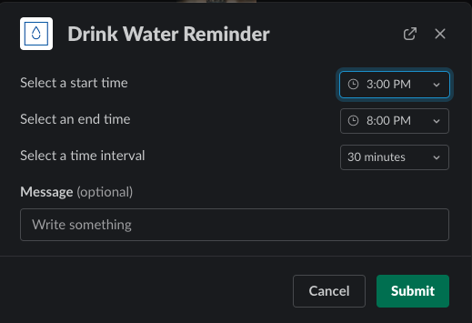
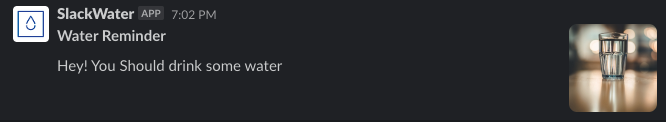

Ruby

A project sugested in [DevProjects by Codementor](https://www.codementor.io/projects/tool/slack-bot-drink-water-reminder-atx32cnbx1) that consists of a Slack Bot that sends reminders for drinking water periodically.

This project uses the [Slack API](https://api.slack.com/) and it was written in Ruby. [Sidekiq](https://github.com/mperham/sidekiq) was used to schedule jobs for sending the reminder messages. Finally, Docker Compose is used to setup all the necessary containers to run locally.

The code can be found [here](https://github.com/pypas/pypas-slack-water).

Slack Modal that opens up when `/slack_water` is called:

An example of reminder that is sent by the Bot:

-----

